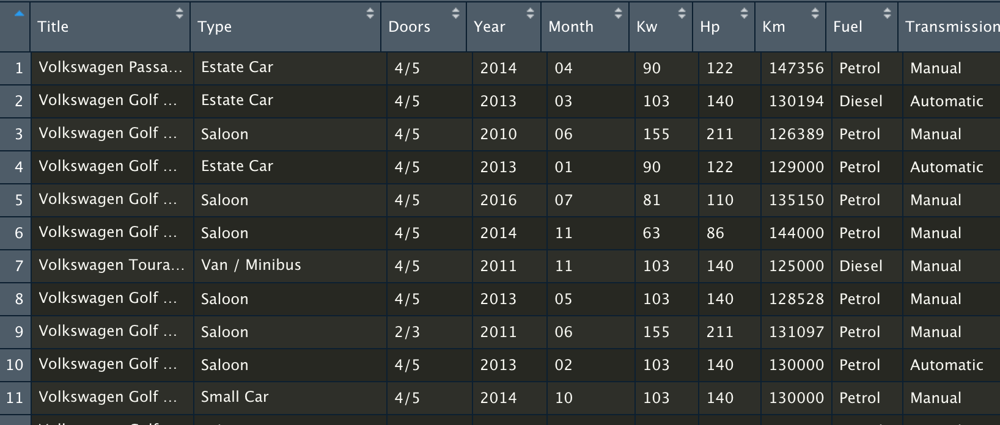
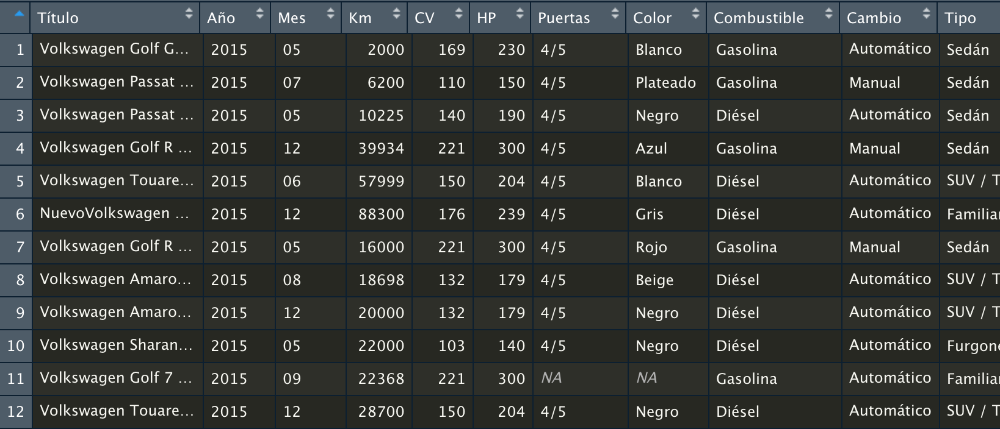

<!-- README.md is generated from README.Rmd. Please edit that file -->

# mobileR

<!-- badges: start -->

<!-- badges: end -->

mobileR is a web scraper for the website mobile.de. You can download the
data easily and create a data frame with only one function.

## Installation

You only have to type the following text in your R studio console:

``` r
library(remotes)
install_github("robertnavca/mobileR")
```

## Function mobile.de\_scraping( )

mobileR only has one function, mobile.de\_scraping(), in with you have
to paste the url of your search and it will do the work for you. It
works for the English and German edition of the web. If you are user of
the Spanish edition, you can paste the Spanish url edition and select
“lang = ‘es’” argument. If you have any cuestion, mayby it could be
solve in the examples section.

## Examples

### English and German edition

This is an example of how easy is to download data with mobileR

``` r
library(mobileR)

# Firstly, save your search url in a new object
my_search <- "https://suchen.mobile.de/fahrzeuge/search.html?damageUnrepaired=NO_DAMAGE_UNREPAIRED&isSearchRequest=true&makeModelVariant1.makeId=25200&maxMileage=150000&maxPowerAsArray=KW&maxPrice=11000&minMileage=125000&minPowerAsArray=KW&minPrice=10000&scopeId=C&sfmr=false"

# Secondly, call the mobileR mein function and introduce the url object. Remember
# to save it in a new object
my_df <- mobile.de_scraping(my_search)
```

That’s all, now you have your data frame created.



## Spanish edition

If you are a Spanish user or mobile.de web you can download data from
the Spanish edition of the web with the lang argument, but remember, if
you introduce an English or german url it will not work.

``` r
my_search <- "https://www.mobile.de/es/veh%C3%ADculo/volkswagen/vhc:car,srt:mileage,sro:asc,ms1:25200__,frn:2015,frx:2015,prn:25000,prx:27500,ful:other!lpg!diesel!petrol!ethanol!hydrogenium!electricity,dmg:false"

my_df <- mobile.de_scraping(my_search, lang = "es")
```

And you will have all the work done,



## Problems

If you find any problem or have a suggestion please cantact with me.
